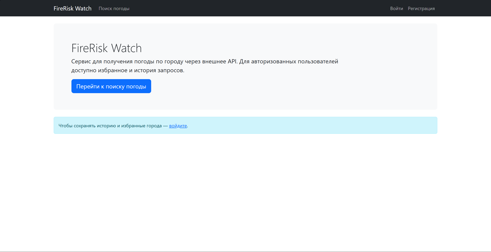
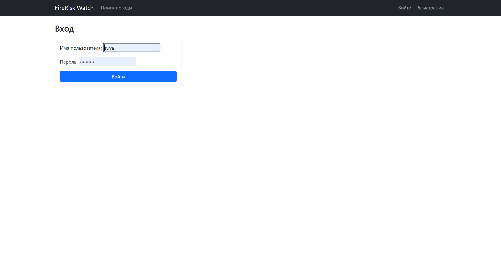
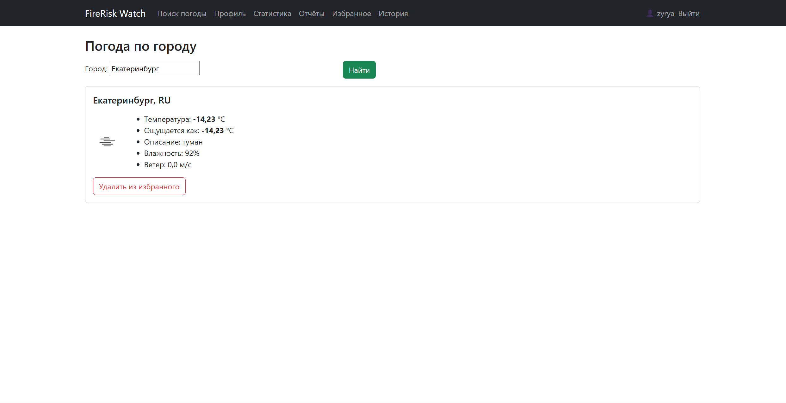
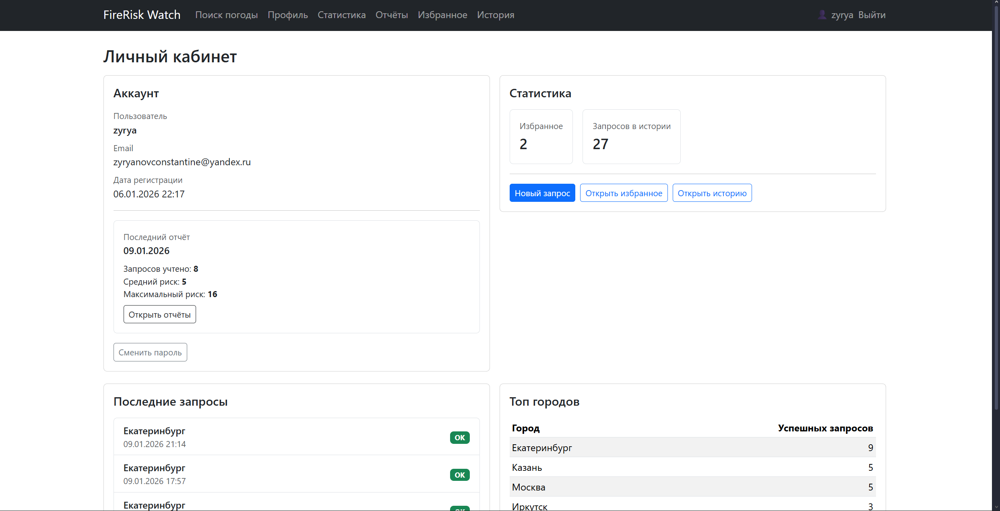
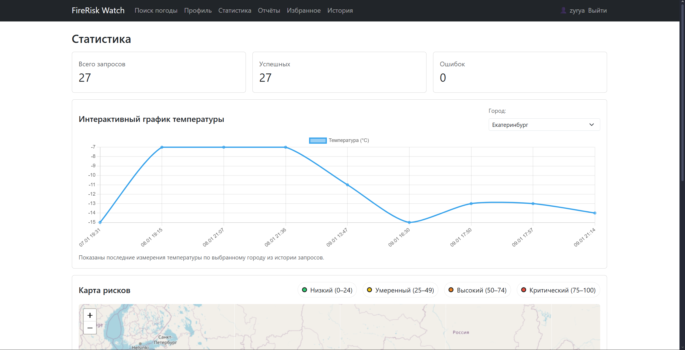
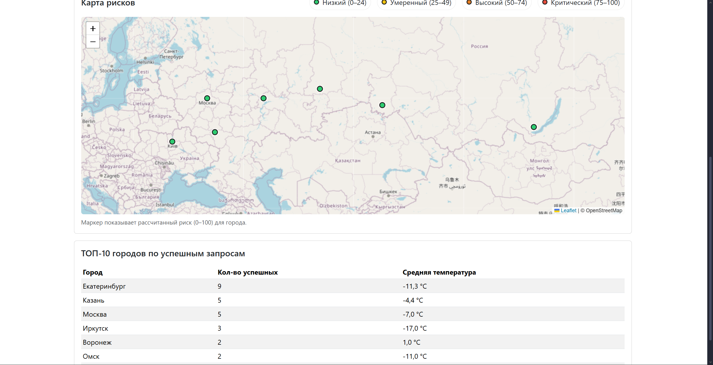
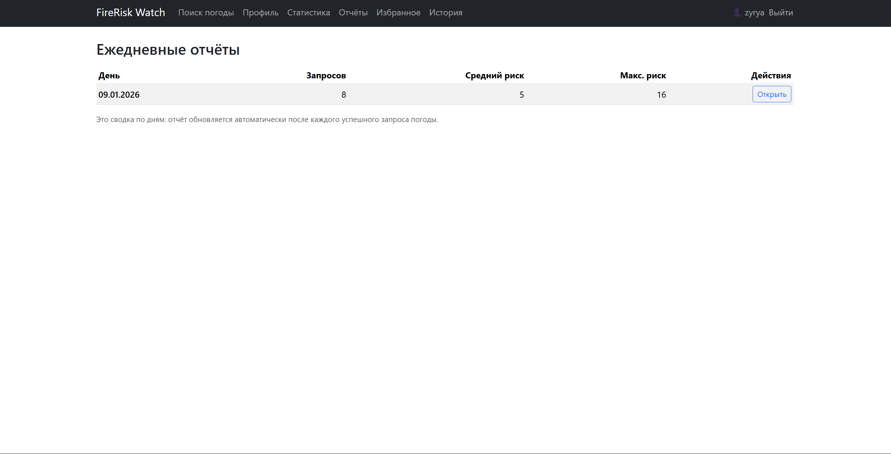
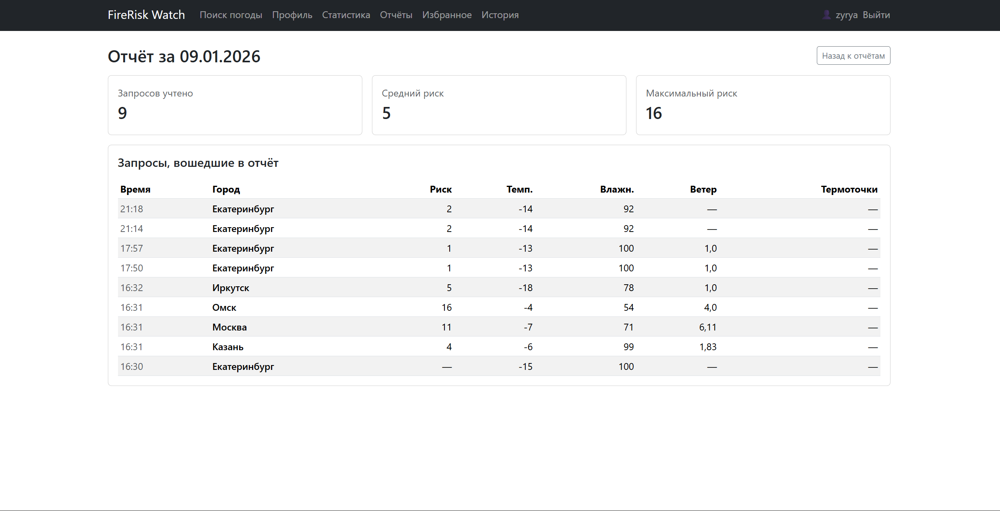
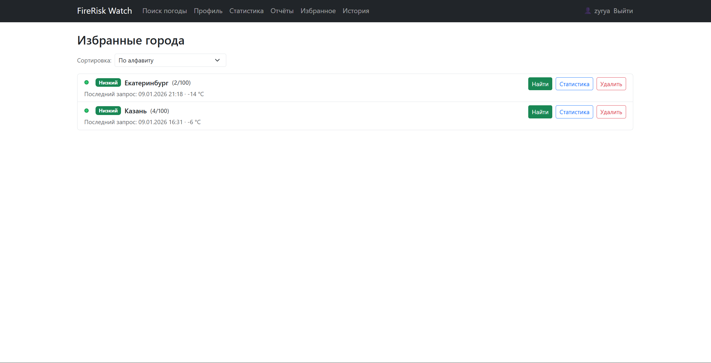

# FireRisk Watch

FireRisk Watch — это веб-сервис для оценки и визуализации пожарной опасности регионов.  
Сервис автоматически получает данные о погоде и пожарах из внешних API, рассчитывает уровень риска и отображает результаты в виде таблиц и графиков.

Проект предназначен для жителей, туристов и аналитиков, которым важно понимать текущую и прогнозируемую пожарную ситуацию в выбранном регионе.

**Рабочая версия проекта:**  
https://babks.pythonanywhere.com

---

## Основные возможности
- Поиск регионов и городов
- Автоматическое получение погодных данных
- Получение данных о пожарах и термоточках
- Расчёт уровня пожарного риска (0–100)
- Визуализация статистики и динамики риска
- Избранные регионы и история запросов для зарегистрированных пользователей
- Административная панель управления данными

---

## Деплой

Проект развёрнут на платформе PythonAnywhere.

В production-окружении:
- используется SQLite
- переменные окружения заданы через PythonAnywhere (Web → Environment variables)
- запуск осуществляется через WSGI

---

## Технологии
**Backend**
- Python 3.x
- Django 6.0
- Django ORM

**Внешние API**
- OpenWeather API
- NASA FIRMS API

**Аналитика и визуализация**
- Chart.js
- Leaflet + OpenStreetMap

**Frontend**
- Django Templates
- Bootstrap

**Инфраструктура**
- SQLite (локальная разработка)
- PythonAnywhere (production)

---

## Настройка окружения
- Файл .env (не коммитится) содержит в себе ключ Django и API ключи:
- DJANGO_SECRET_KEY
- OPENWEATHER_API_KEY
- FIRMS_MAP_KEY

---

## Структура проекта

- config/ — конфигурация Django
- core/ — основное приложение (логика, модели, представления)
- core/templates/ — HTML-шаблоны
- core/migrations/ — миграции базы данных
- manage.py — точка входа

---

## Скриншоты












- Главная страница
- Страница регистрации
- Страница авторизации
- Страница "Поиск погоды"
- Личный кабинет пользователя
- Страница статистики
- Страница отчетов
- Страница с отчетом
- Страница избранного
- Страница истории

---

## Как запустить проект локально

**Клонировать репозиторий**
```bash
git clone https://github.com/Babks/final-django-project.git
cd final-django-project
```

**Создать и активировать виртуальное окружение**
- Windows
```bash
python -m venv .venv
.venv\Scripts\activate
```
- macOS / Linux
```bash
python3 -m venv .venv
source .venv/bin/activate
```

**Установить зависимости**
```bash
pip install -r requirements.txt
```

**Применить миграции базы данных**
```bash
python manage.py migrate
```

**Создать суперпользователя (опционально, для админки)**
```bash
python manage.py createsuperuser
```

**Запустить сервер разработки**
```bash
python manage.py runserver
```

- После запуска проект будет доступен по адресу: http://127.0.0.1:8000/
- Административная панель: http://127.0.0.1:8000/admin/